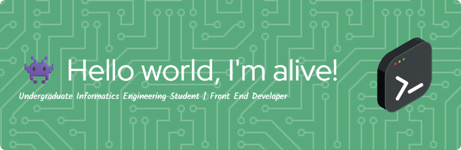

  

  

 

## 💼 Hi there, I'm Raffyqul Azzam! 👋

**Frontend Developer | React Learner | Laravel Explorer**

I'm an enthusiastic Frontend Developer currently interning at **@cazhacademy**, where I'm learning modern web development and building responsive user interfaces with React and Tailwind CSS. I have hands-on experience with Laravel Filament for CMS development.

---

## 🛠️ Skills & Tech Stack

  
  
  
  
  
  
  
  
  
  
  
  

**Frontend:** HTML5, CSS3, JavaScript (ES6+), React.js, Tailwind CSS  
**Backend:** PHP, Laravel (hands-on experience with Filament CMS)  
**Development:** Responsive Design, Mobile-first Approach, Component-based Architecture  
**Tools:** Git, VS Code, npm, Composer, Vite  
**Currently Learning:** Advanced React Patterns, Next.js, TypeScript

---

## 📂 Projects & Works

### 🔭 What I'm Working On:
- **Frontend Development Projects** at [Cazh Academy](https://www.linkedin.com/company/cazh-inovasion/)
- Building responsive web applications with **React.js** and **Tailwind CSS**
- Creating interactive user interfaces and reusable components
- Learning React patterns through hands-on practice
- Developing mobile-first web experiences
- **Achievement:** Built a CMS application using **Laravel Filament**

---

## 🎯 Current Focus / Goals

### 🌟 **Learning Journey**

🎨 **Learning React.js** - Building interactive user interfaces step by step  
🎯 **Exploring React Patterns** - Hooks, Context, Component Architecture  
📱 **Responsive Development** - Mobile-first approach with Tailwind CSS  
⚡ **Performance Awareness** - Writing clean, efficient code  

### 🚀 **Short Term Goals**
- Build more React projects to strengthen my skills
- Create a comprehensive portfolio showcasing my work
- Learn Next.js to expand my frontend capabilities
- Contribute to open-source projects as I grow

### 🌍 **Long Term Vision**
- Become a proficient Frontend Developer
- Deepen my expertise in React ecosystem
- Eventually mentor other aspiring developers
- Build impactful web applications

---

## 🌐 Find Me Elsewhere

  
  
  
  
  

---

## 📊 GitHub Stats

  

  <picture>
    <source media="(prefers-color-scheme: dark)" srcset="https://raw.githubusercontent.com/raffyqulazzam/raffyqulazzam/output/github-contribution-grid-snake-dark.svg">
    <source media="(prefers-color-scheme: light)" srcset="https://raw.githubusercontent.com/raffyqulazzam/raffyqulazzam/output/github-contribution-grid-snake.svg">
    
  </picture>

---

  
  ### 👀 **Profile Views**
  
  
  

  
  **"The only way to learn a new programming language is by writing programs in it." - Dennis Ritchie**
  

